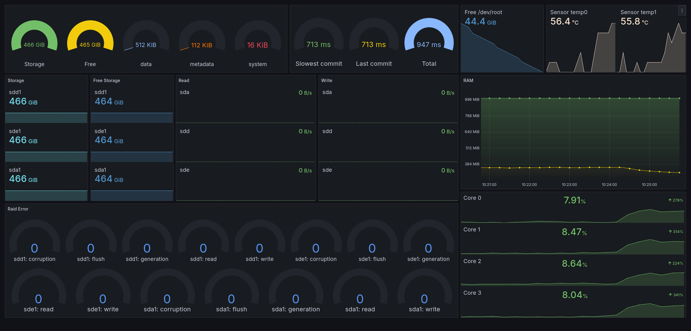

<h1 align='center'>Grafana-Dashboards</h1>

<h6 align='center'>
    This repository contains Grafana dashboards created by me, which provide sufficient monitoring information for my own needs.
</h6>

<h4 align='center'>
    Host and Raid Dashboard
</h4>

<h6 align='center'>
    The Grafana dashboard is running on a Raspberry Pi 3B , providing monitoring for the BTRFS RAID1c3 and the host system.
</h6>

    

