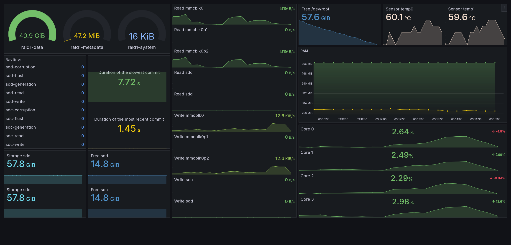

<h1 align='center'>Grafana-Dashboards</h1>

<h6 align='center'>
    This repository contains Grafana dashboards created by me, which provide sufficient monitoring information for my own needs.
</h6>

<h4 align='center'>
    Host and Raid Dashboard
</h4>

    The Grafana dashboard was created to monitor a Btrfs RAID1 with two devices and the host of the RAID.
    It provides a visual representation of system performance, storage usage, and other key metrics to
    ensure effective monitoring and maintenance of the setup.

<h6 align='center'>
    The Grafana dashboard is running on a Raspberry Pi (RPI), providing monitoring for the Btrfs RAID1 and the host system.
</h6>

    

